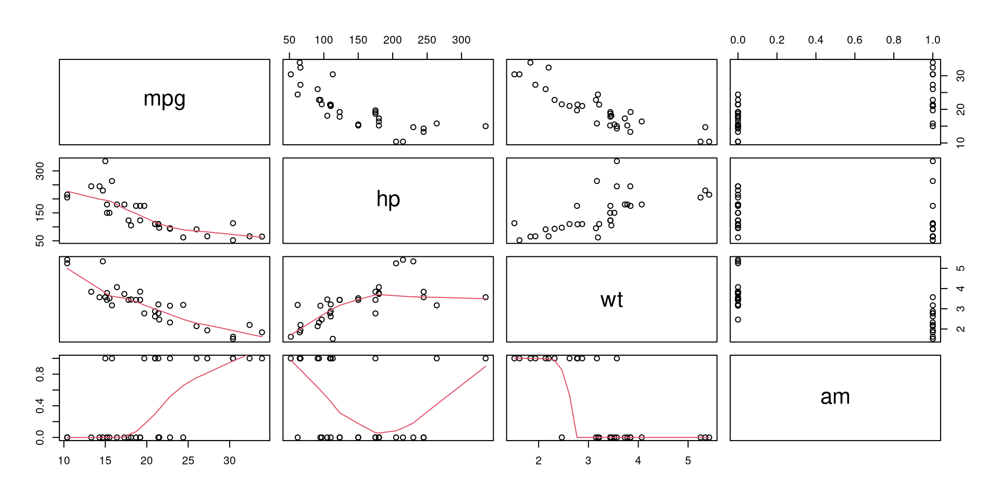
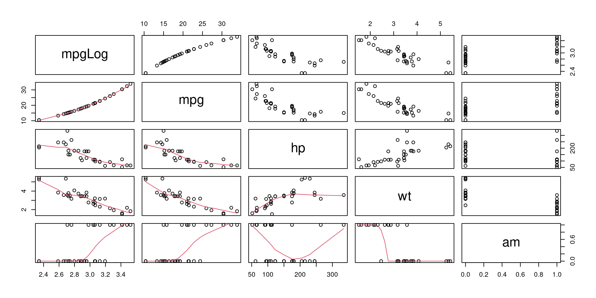
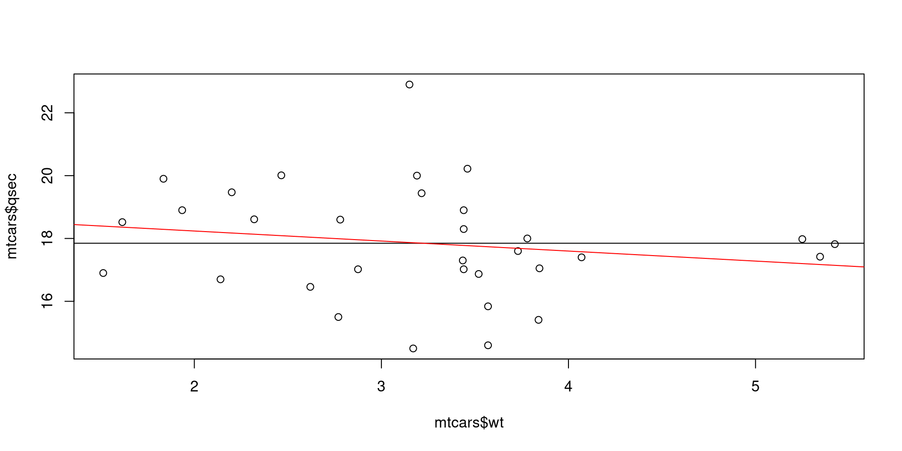
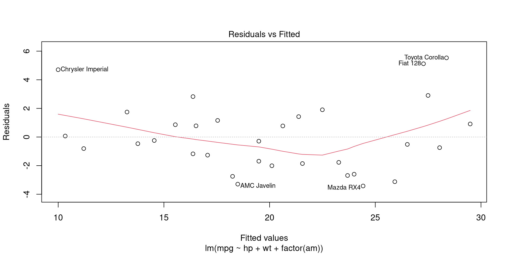
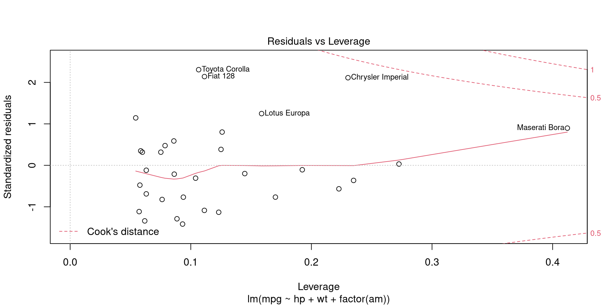
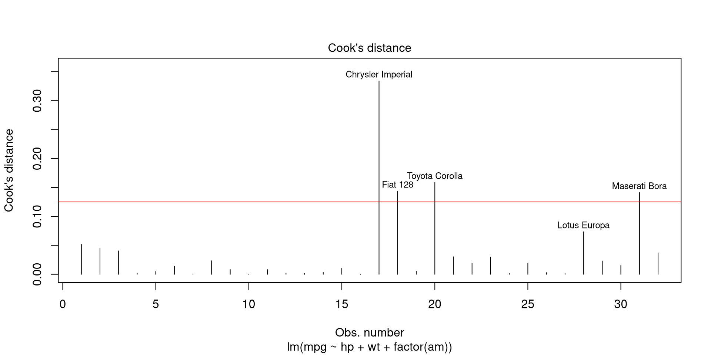
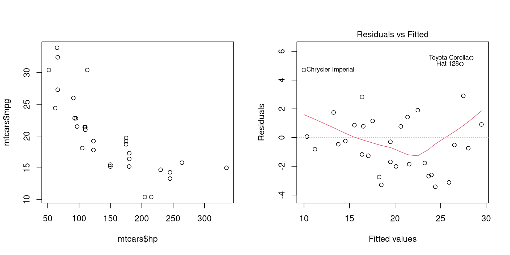

The basic assumptions of least squares regression can be considered the normality and constant variance of residuals. However, there are a number of other aspects that need to be considered to obtain a best linear unbiased estimator. These aspects will be outlined here. Dependent variables will be referred to as **response** and independent variable(s) as **predictor(s)**.

We’ll be using the pipe operator for better readability so let’s first load the `magrittr` package.

``` r
library(magrittr)
```

The `mtcars` dataset in base R is suitable for an example. To begin with, it’s a good idea to plot the relationships between variables of interest together with a LOWESS smoothed line.

``` r
mtcars[, c('mpg', 'hp', 'wt', 'am')] %>% pairs(lower.panel = panel.smooth)
```



The relationships between variables are clearly present. Theoretically, we can expect that horsepower (`hp`), weight (`wt`) and transmission (`am`, automatic (0) or manual (1)) influence fuel consumption (`mpg`).  So let’s model this relationship.

``` r
(mpgMod <- lm(mpg ~ hp + wt + factor(am), mtcars))
```

    ## 
    ## Call:
    ## lm(formula = mpg ~ hp + wt + factor(am), data = mtcars)
    ## 
    ## Coefficients:
    ## (Intercept)           hp           wt  factor(am)1  
    ##    34.00288     -0.03748     -2.87858      2.08371

The resulting coefficients represent model parameters. We can also get 95% confidence intervals for these coefficients.

``` r
confint(mpgMod)
```

    ##                   2.5 %      97.5 %
    ## (Intercept) 28.58963286 39.41611738
    ## hp          -0.05715454 -0.01780291
    ## wt          -4.73232353 -1.02482730
    ## factor(am)1 -0.73575874  4.90317900

A `summary` call of the model provides a lot of information that will be further explained.

``` r
summary(mpgMod)
```

    ## 
    ## Call:
    ## lm(formula = mpg ~ hp + wt + factor(am), data = mtcars)
    ## 
    ## Residuals:
    ##     Min      1Q  Median      3Q     Max 
    ## -3.4221 -1.7924 -0.3788  1.2249  5.5317 
    ## 
    ## Coefficients:
    ##              Estimate Std. Error t value Pr(>|t|)    
    ## (Intercept) 34.002875   2.642659  12.867 2.82e-13 ***
    ## hp          -0.037479   0.009605  -3.902 0.000546 ***
    ## wt          -2.878575   0.904971  -3.181 0.003574 ** 
    ## factor(am)1  2.083710   1.376420   1.514 0.141268    
    ## ---
    ## Signif. codes:  0 '***' 0.001 '**' 0.01 '*' 0.05 '.' 0.1 ' ' 1
    ## 
    ## Residual standard error: 2.538 on 28 degrees of freedom
    ## Multiple R-squared:  0.8399, Adjusted R-squared:  0.8227 
    ## F-statistic: 48.96 on 3 and 28 DF,  p-value: 2.908e-11

# Model explains the data well

A model does not always have to explain the variation of response but in often this is useful, e.g. when comparing models. For linear least squares models goodness of fit can be measured by the coefficient of determination ($$R^2$$). Because it indicates the **part of variation that is explained by the model**, it can be represented by three measures:

- the sum of the squares of differences of each observed value and the mean value of response (**t**otal sum of squares, $$TSS$$), i.e. $$\sum_{i = 1}^{n} (y_{i} - \overline{y}_{i})^2$$; 
- the sum of the squares of differences of the predicted values and the mean value of response (**e**xplained sum of squares, $$ESS$$), i.e. $$\sum_{i = 1}^{n} (\hat{y}_{i} - \overline{y})^2$$; 
- the sum of the squares of differences of the predicted values and observed values (**r**esidual sum of squares, $$RSS$$), i.e. $$\sum_{i = 1}^{n} (y_{i} - \hat{y}_{i})^2$$.

The $$R^2$$ is represented by these measures as follows:

$$R^{2} = \frac{ESS}{TSS} = 1 - \frac{RSS}{TSS}$$

To penalize a model for the number of predictors (*K*) while considering the number of observations (*N*), the adjusted $$R^2$$ can also be used, particularly for model comparison:

$$\overline{R^{2}} = 1 - \frac{RSS/(N-K)}{TSS/(N-K)}$$

In our model, the values of $$R^2$$ and $$\overline{R^{2}}$$ show that our model fits data very well and the predictors describe large part of the variation of the response:

``` r
summary(mpgMod)$r.squared # R-squared
```

    ## [1] 0.8398903

``` r
summary(mpgMod)$adj.r.squared # Adjusted R-squared
```

    ## [1] 0.8227357

# Functional form of the model is correct

The `pairs` plot seems to suggest a non-linear relationship between some variables. Thus, there is reason to expect that the transformation of observed values may result in a model with better fit. We can estimate the correctness of a model specification with a RESET test. This involves testing whether or not the coefficients of exponentiated predicted response values (e.g. $$\hat{y}^2$$) are zero or not when included in the initial model.

``` r
anova(mpgMod, 
      lm(mpg ~ hp + wt + factor(am) + I(mpgMod$$fitted^2) + I(mpgMod$$fitted^3), mtcars))
```

    ## Analysis of Variance Table
    ## 
    ## Model 1: mpg ~ hp + wt + factor(am)
    ## Model 2: mpg ~ hp + wt + factor(am) + I(mpgMod$$fitted^2) + I(mpgMod$$fitted^3)
    ##   Res.Df    RSS Df Sum of Sq      F  Pr(>F)  
    ## 1     28 180.29                              
    ## 2     26 126.79  2    53.502 5.4857 0.01029 *
    ## ---
    ## Signif. codes:  0 '***' 0.001 '**' 0.01 '*' 0.05 '.' 0.1 ' ' 1

> H0: Functional form of the model is correct  
> H1: Functional form of the model is not correct

A *p* value of F-test lower than a a critical value ($$\alpha = 0.05$$) suggests that the model is incorrectly specified.

## Log-linear or log-log relationship

Model fit might be improved by using logged values of the response or predictor variables. For example, we can compare logged and not logged values of fuel consumption (`mpg`) in their relationship with other variables.

``` r
list(mpgLog = log(mtcars$mpg), 
     mtcars[, c('mpg', 'hp', 'wt', 'am')]) %>% 
  pairs(lower.panel = panel.smooth)
```



Logged fuel consumption (`mpg`) does seem to be more linearly related to weight (`wt`) than not logged values, so we can try to estimate a model with logged response variable.

``` r
lm(I(log(mpg)) ~ hp + wt + factor(am), mtcars) %>% summary
```

    ## 
    ## Call:
    ## lm(formula = I(log(mpg)) ~ hp + wt + factor(am), data = mtcars)
    ## 
    ## Residuals:
    ##      Min       1Q   Median       3Q      Max 
    ## -0.17137 -0.06955 -0.03865  0.07218  0.26567 
    ## 
    ## Coefficients:
    ##               Estimate Std. Error t value Pr(>|t|)    
    ## (Intercept)  3.7491397  0.1165798  32.159  < 2e-16 ***
    ## hp          -0.0016850  0.0004237  -3.976 0.000448 ***
    ## wt          -0.1757558  0.0399224  -4.402 0.000142 ***
    ## factor(am)1  0.0516749  0.0607202   0.851 0.401970    
    ## ---
    ## Signif. codes:  0 '***' 0.001 '**' 0.01 '*' 0.05 '.' 0.1 ' ' 1
    ## 
    ## Residual standard error: 0.1119 on 28 degrees of freedom
    ## Multiple R-squared:  0.8724, Adjusted R-squared:  0.8587 
    ## F-statistic: 63.79 on 3 and 28 DF,  p-value: 1.24e-12

Here we can’t use `anova` to test or $$R^2$$ to estimate the improvement of model specification as the variances of response variables are different. It’s important to note that in log-linear and log-log models the coefficients represent elasticities, i.e. not absolute values but *per cent* changes in values of response (log-linear) or both, predictors and response (log-log).

## Polynomials

Another way to obtain a better model fit is by using polynomials.  Commonly, exponentiated values of predictors are used. For example, we can add the exponents of 2 of horsepower (`hp`) and weight (`wt`) to the model and test the result.

``` r
anova(mpgMod, 
      lm(mpg ~ hp + I(hp^2) + wt + I(wt^2) + factor(am), mtcars))
```

    ## Analysis of Variance Table
    ## 
    ## Model 1: mpg ~ hp + wt + factor(am)
    ## Model 2: mpg ~ hp + I(hp^2) + wt + I(wt^2) + factor(am)
    ##   Res.Df    RSS Df Sum of Sq      F  Pr(>F)   
    ## 1     28 180.29                               
    ## 2     26 122.86  2    57.436 6.0776 0.00683 **
    ## ---
    ## Signif. codes:  0 '***' 0.001 '**' 0.01 '*' 0.05 '.' 0.1 ' ' 1

> H0: Model with polynomials does not have lower residual sum of squares  
> H1: Model with polynomials does have lower residual sum of squares

Here, a statistically significant difference at $$\alpha = 0.05$$ suggests a better fit with exponentiated values.

# Model parameters are statistically significant

Determining that the parameters in the model are statistically significant allows us to interpret the values of coefficients and to a certain extent makes sure that they represent more than just random noise in the data.

## Individual significance of parameters (t-test)

To test the significane of the parameters separately we can use t-test.  For each coefficient, we can calculate the value of the t-statistic using estimated value and corresponding standard errors and then estimate the probability of the aquired t value. The `lm` function does all this for us:

``` r
summary(mpgMod)$coefficients
```

    ##                Estimate  Std. Error   t value     Pr(>|t|)
    ## (Intercept) 34.00287512 2.642659337 12.866916 2.824030e-13
    ## hp          -0.03747873 0.009605422 -3.901830 5.464023e-04
    ## wt          -2.87857541 0.904970538 -3.180850 3.574031e-03
    ## factor(am)1  2.08371013 1.376420152  1.513862 1.412682e-01

> H0: The coefficient is zero, i.e. $$\beta = 0$$  
> H1: Thecoefficient is not zero, i.e. $$\beta ≠ 0$$

In our case horsepower and weight have a statistically significant effect on fuel consumption while transmisson does not ($$\alpha = 0.05$$). It’s worth noting that a statistically insignificant parameter should not be excluded from a model when there is a valid causal relationship from a theoretical point of view.

## Combined significance of parameters (f-test)

F-test can be used to compare models by comparing residual sums of squares. First, we can test if the model with parameters (full model) fits data better than a model with only the intercept (reduced model).  Although this is also reported by `summary.lm`, we can use analysis of variance to test this explicitly:

``` r
anova(lm(mpg ~ hp + wt + factor(am), mtcars), # Full model
      lm(mpg ~ 1, mtcars)) # Reduced model
```

    ## Analysis of Variance Table
    ## 
    ## Model 1: mpg ~ hp + wt + factor(am)
    ## Model 2: mpg ~ 1
    ##   Res.Df     RSS Df Sum of Sq     F    Pr(>F)    
    ## 1     28  180.29                                 
    ## 2     31 1126.05 -3   -945.76 48.96 2.908e-11 ***
    ## ---
    ## Signif. codes:  0 '***' 0.001 '**' 0.01 '*' 0.05 '.' 0.1 ' ' 1

> H0: All coefficients are simultaineously zero  
> H1: At least one of the coefficients is not zero 0

In our model at least one of the coefficients is not zero. But we could, for example, also estimate the effect of weight of a car (`wt`) on it’s 1/4 mile time (`qsec`). In addition to an F-test, we can also visually confirm that the slope is not very different from zero.

``` r
# F-test
redMod <- lm(qsec ~ 1, mtcars) # Reduced model
fullMod <- lm(qsec ~ wt, mtcars) # Full model
anova(fullMod, redMod)
```

    ## Analysis of Variance Table
    ## 
    ## Model 1: qsec ~ wt
    ## Model 2: qsec ~ 1
    ##   Res.Df    RSS Df Sum of Sq      F Pr(>F)
    ## 1     30 95.966                           
    ## 2     31 98.988 -1   -3.0217 0.9446 0.3389

``` r
# Visual
plot(mtcars$wt, mtcars$qsec)
abline(redMod) # Reduced model
abline(fullMod, col = 'red') # Full model
```



A second use for the F-test is to compare nested models. We can test if the coefficients for horsepower (`hp`) and transmission (`am`) are **simultaineously** significantly different from zero.

``` r
anova(lm(mpg ~ hp + wt + factor(am), mtcars), 
      lm(mpg ~ wt, mtcars))
```

    ## Analysis of Variance Table
    ## 
    ## Model 1: mpg ~ hp + wt + factor(am)
    ## Model 2: mpg ~ wt
    ##   Res.Df    RSS Df Sum of Sq      F   Pr(>F)   
    ## 1     28 180.29                                
    ## 2     30 278.32 -2   -98.031 7.6123 0.002291 **
    ## ---
    ## Signif. codes:  0 '***' 0.001 '**' 0.01 '*' 0.05 '.' 0.1 ' ' 1

> H0: All coefficients in full but not in reduced model are zero  
> H1: At least one of the coefficients in full but not in reduced model are not zero

Insignificant F-statistic shows that we can reject the null hypothesis that the coefficients of `hp` and `factor(am)` are simultaineously zero.

# Model is not sensitive to individual observations

Even a small number of extreme observations can substantially alter model parameters in least squares estimation. Thus, it’s important to be aware of atypical observatons and deal with them.

## Residuals

A simple approach is to take a look at residuals at different fitted values. Residuals can be visualized by calling the 1st plot of `plot.lm` function. The function accepts `labels.id` and `id.n` as argumets which respectively set the vector used for point labels and the number of labels to add (starting from extreme values). This allows to understand which observations represent outliers in modelled relationship.

``` r
plot(mpgMod, which = 1, labels.id = rownames(mtcars), id.n = 5) # Residuals vs fitted
```



The observations with residuals that markedly diverge from 0 are outliers and may have a large influence on model parameters.

## Leverage of observations

A more reliable method for detecting influential observations is to calculate leverage for each observation. Because predicted responses $$\hat{y}$$ are equal to matrix $$H = X(X^{T}X)^{-1}X^{T}$$ multiplied by observed responses $$y$$, the value of $$h_{ii} = [H]_{ii}$$ expresses the leverage of $$i$$th observation. That is, the leverage score $$h_{ii}$$ represents the weight of $$i$$th observaton on predicted response $$\hat{y}_{i}$$. Leverages (along with residuals) can be visualized by calling the 5th plot of `plot.lm`. 

``` r
plot(mpgMod, which = 5, id.n = 5) # Residuals vs leverage
```



The value of leverage score $$h_{ii}$$ is between 0 and 1, thus a leverage over 0.4 (Maserati Bora)  is rather high.

## Influence of observations (Cook’s distance)

Influence of obsevations can also be determined by calculating how much model parameters change if an observation is omitted. This is what Cook's distance estimate $$D_{i}$$ for observation $$i$$ represents:

$$D_{i} = \frac{\sum_{j=i}^{n}(\hat{y}_{j} - \hat{y}_{j(i)})^2} {p s^{2}}$$,

which, put plainly, is the sum of all differences in $$\hat{y}$$ when observation $$i$$ is omitted, divided by number of parameters $$p$$ multiplied by mean squared error $$s^{2}$$. Cook's distance can be plotted by calling 4th plot of `plot.lm`. A Cook's distance value that is higher than 4 divided by number of observations may be considered as influential, although there are less conservative suggestions for tresholds.

``` r
plot(mpgMod, which = 4, id.n = 5) # Cook's distance
abline(h = 4/nrow(mtcars), col = 'red')
```



When following the suggestion of 4/N for treshold, there are 4 influential observations in our model.

# Error term is independent and has constant variance

Serial correlation and non-constant variance of residuals imply that model standard errors and thus respective p-values for coefficients are incorrect. In order to interpret the model parameters it's important to make sure that homoscedasticity nor autocorrelation are present and use corrected standard errors if otherwise. 

## Heteroscedasticity

Heteroscedasticity occurs when variance of error term for each observation might be different, i.e. is not constant, i.e. $$var(\varepsilon\|X) \neq \sigma^{2}$$. Heteroscedasticity is usually evident when variables are plotted against each other or when residuals are plotted at different values of response variables.

``` r
par(mfrow = 1:2)
plot(mtcars$hp, mtcars$mpg)
plot(mpgMod, which = 1)
```



``` r
dev.off()
```

    ## null device 
    ##           1

We can notice the lower variance of fuel consumption (`mpg`) at higher values of horsepower (`hp`).

One way to assess heteroscedasticity is to test whether variance of residuals is dependent on values of the predictors. This procedure is called Breusch-Pagan test.

``` r
modBp <- lm(mpgMod$residuals^2 ~ hp + wt + factor(am), mtcars)
bpTest <- nobs(modBp) * summary(modBp)$r.squared # Test statistic
pchisq(bpTest, df = modBp$rank - 1, lower.tail = FALSE)
```

    ## [1] 0.1366163

An alternative is to use the `bptest` function from `lmtest` package.

``` r
lmtest::bptest(mpgMod)
```

    ## 
    ##  studentized Breusch-Pagan test
    ## 
    ## data:  mpgMod
    ## BP = 5.534, df = 3, p-value = 0.1366

> H0: Homoscedasticity  
> H1: Heteroscedasticity

A $$\chi^2$$-test indicates that variance of residuals is independent of values of the predictors ($$\alpha = 0.05$$) and we can assume homoscedasticity.

## Autocorrelation

Autocorrelation occurs when error terms of different observations are correlated with each other, i.e. $$cov(\varepsilon_{i}\varepsilon_{j}\|X) \neq 0, i \neq j$$. Autocorrelatoin can be tested with Breusch-Godfrey test (`bgtest`) from `lmtest` package. 

``` r
lmtest::bgtest(mpgMod)
```

    ## 
    ##  Breusch-Godfrey test for serial correlation of order up to 1
    ## 
    ## data:  mpgMod
    ## LM test = 2.156, df = 1, p-value = 0.142

> H0: No autocorrelation  
> H1: Autocorrelation

A p-value of 0.142 indicates lack of autocorrelation in our model ($$\alpha = 0.05$$).

## Robust standard errors

Suppose that we have a model where heteroscedasticity is present (`wt ~ hp`, adding horsepower makes cars heavier).

``` r
wtMod <- lm(wt ~ hp, mtcars)
summary(wtMod)
```

    ## 
    ## Call:
    ## lm(formula = wt ~ hp, data = mtcars)
    ## 
    ## Residuals:
    ##      Min       1Q   Median       3Q      Max 
    ## -1.41757 -0.53122 -0.02038  0.42536  1.56455 
    ## 
    ## Coefficients:
    ##             Estimate Std. Error t value Pr(>|t|)    
    ## (Intercept) 1.838247   0.316520   5.808 2.39e-06 ***
    ## hp          0.009401   0.001960   4.796 4.15e-05 ***
    ## ---
    ## Signif. codes:  0 '***' 0.001 '**' 0.01 '*' 0.05 '.' 0.1 ' ' 1
    ## 
    ## Residual standard error: 0.7483 on 30 degrees of freedom
    ## Multiple R-squared:  0.4339, Adjusted R-squared:  0.4151 
    ## F-statistic:    23 on 1 and 30 DF,  p-value: 4.146e-05

``` r
lmtest::bptest(wtMod)
```

    ## 
    ##  studentized Breusch-Pagan test
    ## 
    ## data:  wtMod
    ## BP = 7.6716, df = 1, p-value = 0.00561

We can expect that these standard errors are not reliable, so they need to be corrected. This involves calculating heteroscedasticity consistent (HC) standard errors. This can be done by plugging a defined symmetric diagonal matrix $$\Omega = diag(\omega_{1},...,\omega_{i})$$ into coefficient covariance matrix and calculating standard errors from the result (Zeileis 2004[^1]). There are different estimators for $$\omega{i}$$ but in most cases we can use $$\varepsilon^{2}_{i}$$. Such covariance matrix with can be calculated with `vcovHC` function from `sandwhich` package setting `HC0` as type. We can get the t- and p-values with HC standard errors with `coeftest` function from `lmtest` pacakge by inserting the new covariance matrix into initial model.

``` r
wtModVcov <- sandwich::vcovHC(wtMod, 'HC0') # Calculate covariance matrix
wtModVcov %>% diag %>% sqrt # Get robust standard errors
```

    ## (Intercept)          hp 
    ## 0.339692165 0.002611827

``` r
lmtest::coeftest(wtMod, vcov = wtModVcov) # Find p-values
```

    ## 
    ## t test of coefficients:
    ## 
    ##              Estimate Std. Error t value  Pr(>|t|)    
    ## (Intercept) 1.8382467  0.3396922  5.4115 7.288e-06 ***
    ## hp          0.0094010  0.0026118  3.5994  0.001133 ** 
    ## ---
    ## Signif. codes:  0 '***' 0.001 '**' 0.01 '*' 0.05 '.' 0.1 ' ' 1

We can see that while the p-value for `hp` coefficient calculated with robust standard errors is still statistically significant ($$\alpha = 0.05$$), it's much higher than before.

# Error term is uncorrelated to predictor(s)

When error term is correlated to a predictor, i.e. $$cov(x_{i},\varepsilon) \neq 0$$, the model parameters are biased and not consistent. The predictors causing this are endogenous to the model and in such cases we need to find an instrumental variable (instrument) that is correlated to the endogenous predictors but not the error term.

Let's estimate the effect of engine size (`disp`, displacement) and horsepower (`hp`) on fuel consumption (`mpg`). 

``` r
ivModInit <- lm(mpg ~ hp + disp, mtcars)
summary(ivModInit)
```

    ## 
    ## Call:
    ## lm(formula = mpg ~ hp + disp, data = mtcars)
    ## 
    ## Residuals:
    ##     Min      1Q  Median      3Q     Max 
    ## -4.7945 -2.3036 -0.8246  1.8582  6.9363 
    ## 
    ## Coefficients:
    ##              Estimate Std. Error t value Pr(>|t|)    
    ## (Intercept) 30.735904   1.331566  23.083  < 2e-16 ***
    ## hp          -0.024840   0.013385  -1.856 0.073679 .  
    ## disp        -0.030346   0.007405  -4.098 0.000306 ***
    ## ---
    ## Signif. codes:  0 '***' 0.001 '**' 0.01 '*' 0.05 '.' 0.1 ' ' 1
    ## 
    ## Residual standard error: 3.127 on 29 degrees of freedom
    ## Multiple R-squared:  0.7482, Adjusted R-squared:  0.7309 
    ## F-statistic: 43.09 on 2 and 29 DF,  p-value: 2.062e-09

There's a statistically significant relationship. However, theoretically more weight (`wt`) and number of carburetors (`carb`) require a larger engine (`disp`), so it could actually be these two variables that increase fuel consumption. We can estimate the instrumental variable regression by two-stage least squares (2SLS) either manually or use the `ivreg` function from `AER` package. In the second stage there's an option to either replace the endogenous variable with predicted values from 1st stage or just add residuals from the 1st stage. Note that the standard errors in the 2nd stage are incorrect when calculated manually as below.

``` r
# Manually
(ivModS1 <- lm(disp ~ hp + wt + carb, mtcars))
```

    ## 
    ## Call:
    ## lm(formula = disp ~ hp + wt + carb, data = mtcars)
    ## 
    ## Coefficients:
    ## (Intercept)           hp           wt         carb  
    ##    -113.982        1.197       76.759      -27.674

``` r
(ivModS2Fit <- lm(mpg ~ hp + ivModS1$fitted, mtcars)) # Replace disp
```

    ## 
    ## Call:
    ## lm(formula = mpg ~ hp + ivModS1$$fitted, data = mtcars)
    ## 
    ## Coefficients:
    ##    (Intercept)              hp  ivModS1$$fitted  
    ##       30.88810        -0.01447        -0.03760

``` r
(ivModS2Res <- lm(mpg ~ hp + disp + ivModS1$residuals, mtcars)) # Add residuals
```

    ## 
    ## Call:
    ## lm(formula = mpg ~ hp + disp + ivModS1$$residuals, data = mtcars)
    ## 
    ## Coefficients:
    ##       (Intercept)                 hp               disp  ivModS1$$residuals  
    ##          30.88810           -0.01447           -0.03760            0.03368

``` r
# AER::ivreg
ivModS2Ivreg <- AER::ivreg(mpg ~ hp + disp | hp + wt + carb, data = mtcars)
summary(ivModS2Ivreg, vcov = sandwich::sandwich, diagnostics = T)
```

    ## 
    ## Call:
    ## AER::ivreg(formula = mpg ~ hp + disp | hp + wt + carb, data = mtcars)
    ## 
    ## Residuals:
    ##     Min      1Q  Median      3Q     Max 
    ## -5.0066 -2.3808 -0.3478  1.8353  6.6258 
    ## 
    ## Coefficients:
    ##              Estimate Std. Error t value Pr(>|t|)    
    ## (Intercept) 30.888099   1.367368  22.589  < 2e-16 ***
    ## hp          -0.014474   0.009231  -1.568    0.128    
    ## disp        -0.037596   0.007120  -5.280 1.16e-05 ***
    ## 
    ## Diagnostic tests:
    ##                  df1 df2 statistic  p-value    
    ## Weak instruments   2  28    66.105 2.48e-11 ***
    ## Wu-Hausman         1  28     5.122   0.0316 *  
    ## Sargan             1  NA     6.028   0.0141 *  
    ## ---
    ## Signif. codes:  0 '***' 0.001 '**' 0.01 '*' 0.05 '.' 0.1 ' ' 1
    ## 
    ## Residual standard error: 3.178 on 29 degrees of freedom
    ## Multiple R-Squared: 0.7399,  Adjusted R-squared: 0.722 
    ## Wald test:  52.6 on 2 and 29 DF,  p-value: 2.252e-10

The `summary` output of `ivreg` includes three diagnostic tests given that `diagnostics = T` is passed to the function. 

### Weak instruments

The weakness of instruments can be estimated with an F-test to determine weather the instrument has an effect on the endogenous variable.

``` r
anova(lm(disp ~ hp, mtcars), # Model without instruments
      lm(disp ~ hp + wt + carb, mtcars)) # Model with instruments
```

    ## Analysis of Variance Table
    ## 
    ## Model 1: disp ~ hp
    ## Model 2: disp ~ hp + wt + carb
    ##   Res.Df    RSS Df Sum of Sq      F    Pr(>F)    
    ## 1     30 178284                                  
    ## 2     28  38378  2    139906 51.037 4.587e-10 ***
    ## ---
    ## Signif. codes:  0 '***' 0.001 '**' 0.01 '*' 0.05 '.' 0.1 ' ' 1

> H0: All instruments have no effect  
> H1: At least one of the instruments has an effect

### Wu-Hausmann test

The coefficient for `disp` is efficient but potentially inconsistent. We can assess the consistency of the predictors in the OLS model by testing whether the model parameters given by OLS and IV models are different. This can be done with the (Durbin-)Wu-Hausman test where the test statistic is as follows.

$$H = (b_{IV} - b_{OLS})^T(var(b_{IV}) - var(b_{OLS}))^{+}(b_{IV} - b_{OLS})$$

``` r
olsMod <- lm(mpg ~ hp + disp, mtcars)
(coefDiff <- coef(ivModS2Ivreg) - coef(olsMod)) # Difference in coefficient vectors
```

    ##  (Intercept)           hp         disp 
    ##  0.152194751  0.010365781 -0.007249964

``` r
(covDiff <- vcov(ivModS2Ivreg) - vcov(olsMod)) # Difference of covariance matrices of coefficients
```

    ##               (Intercept)            hp          disp
    ## (Intercept)  0.0654566494  1.955037e-04 -3.642333e-04
    ## hp           0.0001955037  3.768635e-05 -2.480745e-05
    ## disp        -0.0003642333 -2.480745e-05  1.735066e-05

``` r
(whStat <- c(t(coefDiff) %*% solve(covDiff) %*% coefDiff)) # Wu-Hausman statistic
```

    ## [1] 3.029394

``` r
pchisq(whStat, df = olsMod$rank, lower.tail = F) # Find the significance of the test statistic
```

    ## [1] 0.3871153

> H0: The predictor in the OLS model is not correlated to the error term and consistent  
> H1: The predictor in the OLS model is correlated to the error term and not consistent

### Sargan test

When we use more than one instrument, the restrictions may be overidentified. We can test this by calculationg a test statistic from the effects of exogenous variables on the residuals from the 2nd stage of IV model.

``` r
sarMod <- lm(ivModS2Ivreg$resid ~ hp + wt + carb, mtcars)
sarStat <- summary(sarMod)$r.squared * nobs(sarMod)
sarDf <- 2 - 1 # Degrees of freedom: number of instruments - number of endogenous variables
1 - pchisq(sarStat, sarDf)
```

    ## [1] 0.01407694

> H0: All instruments are valid  
> H1: At least one of the instruments is not valid

Here we reject the null hypothesis ($$\alpha = 0.05$$) and assume that either `wt` or `carb` is not a valid instrument.

# Predictors can not be linearly predicted from others (no multicollinearity)

When one predictor variable can be linearly predicted from others, the model parameters are  sensitive to changes in model or data. We can evaluate multicollinearity by calculating a variance inflation factor (VIF) for each predictor. VIF expresses the variaton of a predictor that can be explained by other predictors in the model.

$$VIF_{i} = \frac{1}{1 - R^{2}_{i}}$$

Hence, it’s simple to calculate manually but we can also use the `vif` function from package `car`.

``` r
# Manually
for (i in attributes(mpgMod$terms)$term.labels) {
  formula <- paste(i, "~", 
                   paste(setdiff(attributes(mpgMod$terms)$$$term.labels, i), collapse = "+"))
  model <- lm(formula, mtcars)
  print(1/ (1 - summary(model)$r.squared))
}
```

    ## [1] 2.088124
    ## [1] 3.774838
    ## [1] NA

``` r
# car::vif
car::vif(mpgMod)
```

    ##         hp         wt factor(am) 
    ##   2.088124   3.774838   2.271082

The manual calculation did not yield a VIF value for `factor(am)` which should not be a problem since VIF is not very meaningful for nominal variables. A VIF value of >10 is usually considered as a sign of high multicollinearity.

---

[^1]: Zeileis, A. (2004). Econometric Computing with HC and HAC Covariance Matrix Estimators. Journal of Statistical Software, 11(1), 1–17. https://doi.org/10.18637/jss.v011.i10

<!-- MathJax -->
<script type="text/javascript"
  src="https://cdnjs.cloudflare.com/ajax/libs/mathjax/2.7.3/MathJax.js?config=TeX-AMS-MML_HTMLorMML">
</script>
