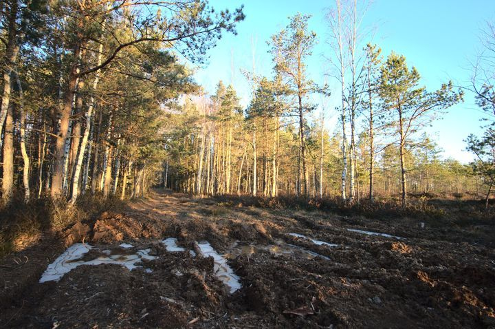
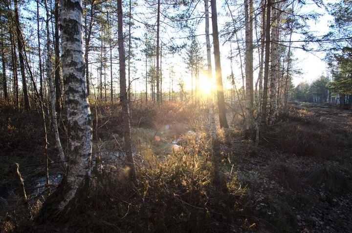
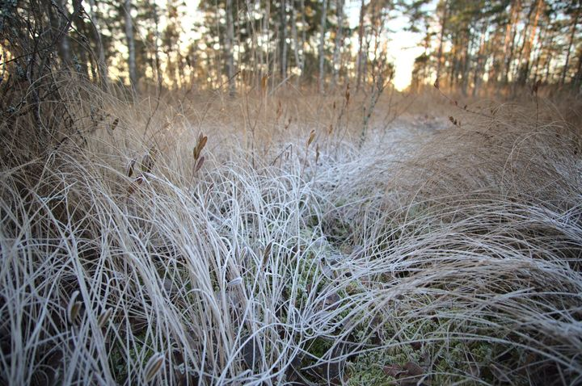
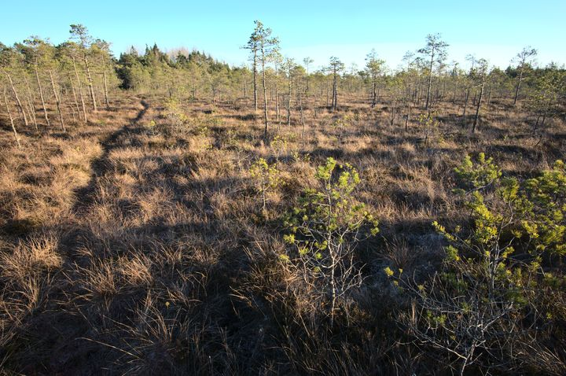
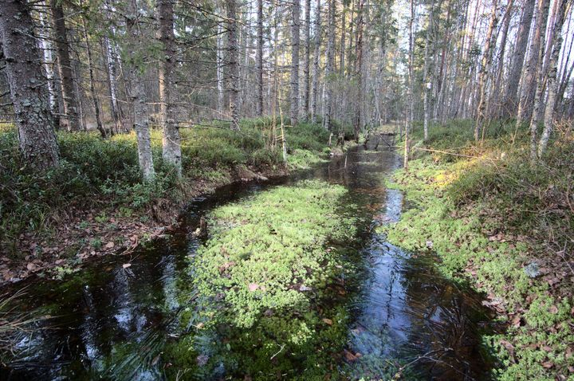
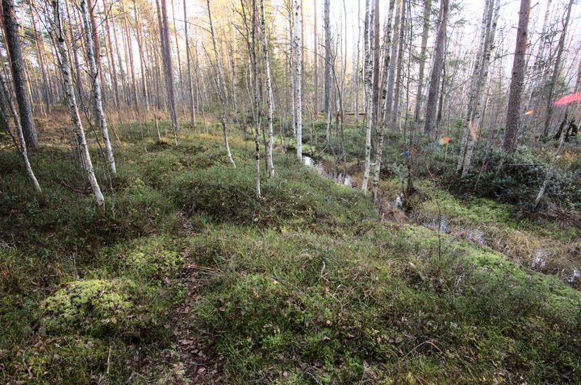
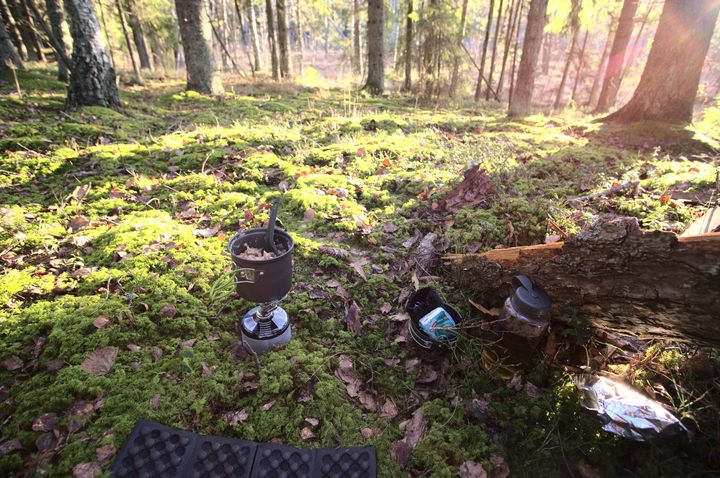
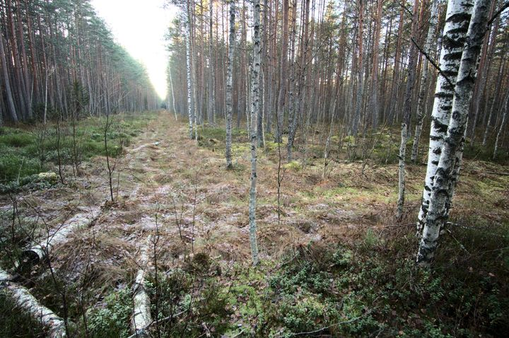
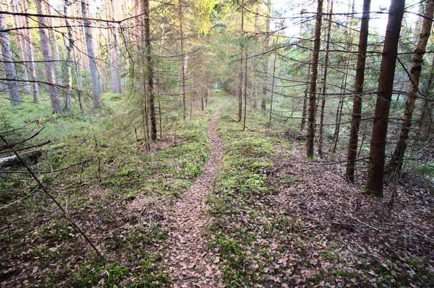
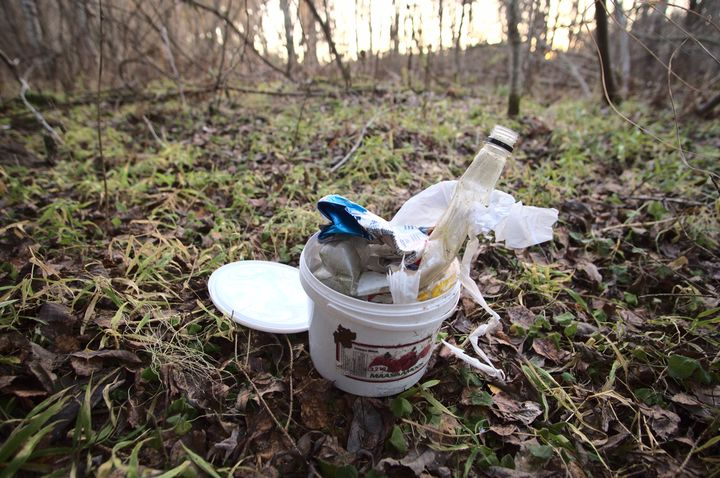

Ega mul mingit põhjust just Pähklisaare maastikukaitsealakülastada ei olnud. Otsisin sellist kohta, kus saaks mõned tunnid niimoodi jalutada, et kellegi põllule või õuele ei satuks, ja natuke puutumata loodust lootsin ka leida. Tartu ümbruses selliseid kohti tegelikult ei olegi ja lähim koht tundus olevat see sama Laukasoo kant.

Pähklisaare ümbruse piirkonna on päästnud üles harimisest liigniiske maastik, kuigi töö raba hävitamiseks käib seal kõrval suure hooga ja umbes kolmandik piirkonna rabast on juba üles freesitud. Majandustegevusest puutumata raba osa kaitseb juba paarkümmend aastat Pähklisaare maastikukaitseala. Pähklisaar on tegelikult üsna väike ja raba keskel asub hoopis suurem Rehtessaar ja sellest idas on Laukasoo.



Jõuan lõuna poolt Rehtessaarele viiva tee otsa hommikul pärast üheksat. Teel päästab järsk pidurdamine kokkupõrkest, kui kolm kitse otsustavad just minuga samal ajal ja samas kohas korraks seda teed kasutada. Vähemalt on siin loomi. Juba päris saareni viiva tee alguses on sinna tõkkeks asetatud neli rehvi. Jään viisakaks ja jätan auto nende äärde, ruumi napilt parkimiseks. Kuna nõrga mootoriga auto sureb seal võsas parkimisel korduvalt välja, siis jääb kripeldama, kas aku ka päeva lõpus veel küünlale piisavalt särtsu annab. On varem juhutnud, et mitte. 

Õhk on umbes -7°C ja taevas pilvitu. Kuigi lund ei ole, siis maa on härmas. Lühikeskeks jautuskäiguks on selline ilm suurepärane: ei ole palav, niiske ega pime.

Hakkan minema otse Rehtessaare poole, kuhu viib  1,6 km pikkune sirge sõidutee. Alguses paistab tee tõesti sõiduautoga läbitav, aga rabale lähenedes on tee juba sõidukitega korralikult üles songitud. Keegi on hiljuti isegi okstega roopaid täitnud. Ei tea, mis asja siia autoga üldse on, Rehtessaarele viib kaardi järgi ju põhja poolt korralik sõidutee ja siit lõunapooltki on ainult veerand tundi jalutada.

Tee on alguses üsna üksluine, kuid rabale lähendes asendub segamets kena kasealleega ja puude vahelt paistab soojas hommikuvalguses raba. See valgus on pildistamiseks suurepärane ja ma ei hoia ennast siin kaameraga tagasi. 

Rabasaarel olevat teed ilmestab jälle ilmetu segamets ja puupõlluna istutatud kuused. Kuna ma ei taha minna rabasaarel asuva õueni, siis keeran ühes kurvis päikese poole. Saare idaservani jõudes avaneb hommikupäikese käes särav raba. Kuigi õhk on mitu päeva olnud alla nulli ja kohati saab jääle astuda, siis vajub rabapinnasele astudes jalg ikkagi märga maapõue. Õhuline rabataimestik hoiab maapinda läbi külmumast. Eelmisest aastajast jäänud jõhvikad on aga läbi külmunud ja maitsvad. 

Olles Rehtessaare selja taha jätnud, otsustan minna mööda metsasihti ja satun õige pea jalgrajale. Sisse tallatud tee ja männioksale riputatud pisike kummik viitavad sellele, et tegemist on päris sageli külastatava kohaga. Kuigi kavatsen sõiduteele minna mööda sihte, siis jõuan sinna kogemata hoopis mööda seda sama jalgrada. Sõiduteel on selle raja algus päris hästi tähistatud. Tähiseks on sealt samast maha saetud ja kraavile selle ületamiseks asetatud kolm palki. Kaitsealal muidugi niimoodi viisakas teha ei ole.

Edasi otsustan minna mööda raba ääres asuvat kraavi otse itta. Kuigi pole üldse selge, kas see rabaäär on läbimiseks piisavalt kuiv, annab kraavi olemasolu selleks siiski lootust. Lootus on põhjendatud. Kraaviäär on kõrge ja selle ääres tallatud rada. Loodan, et loomade poolt. Kraavis on isegi nii palju vett, et saan janu kustutada, pean vaid jääkoorikut lõhkuma. Vesi on rabaveele omaselt isegi pärast puhastamist pruun ja vastiku maitsega. 

Kraavi lõppu jõudes paistab päike, kuna kraavi lõunakülg on lagedaks raiutud. Mõnus koht selleks, et korraks puu all istuda ja hinge tõmmata. Edasi kavatsen minna raba kaguküljes asuvale kõrgendikule. Sinna peaks viima nagu metsasiht, aga vehin ennast hoopis läbi tiheda kuusevõsa. Kuusevõsad on läbimiseks väga ebameeldivad, kuna tihedaid okasteta madalaid oksi on raske märgata ja need kipuvad just silma sattuma. Nii juhtub ka siin, aga nägemine jääb sellel korral alles. 

Kaardi reljeefi järgi kõrgendikuna tunduv koht on vaevalt ümbrusest kõrgem. Sellegipoolest on siin hõre ja seetõttu päikseline männimets. Sellised kohad on kenad, kuna isegi praegusel kõige ilmetumal aastaajal on samblane metsaalune roheline, mitte kaetud kõdunevate lehtedega nagu ümbruses. Seetõttu teen siin plaanitud lõunasöögi, kuigi kõht veel tühi ei ole. Tegelikult ei teagi, miks nii lühikesele jalutuskäigule toidunõud kaasa võtsin. Kunagi romantilisena tunduv looduses toidu valmistamine on nüüdseks liiga tavaliseks muutunud. Kuigi tegemist on väga hõredalt asustatud piirkonnaga, siis vähemalt sel päeval siin mingit rahu ja vaikust ei ole. Ilmselt raba freesimise mürin on see, mis siia lääne poolt paari kilomeetri kauguselt kostab. 

Päikeseloojanguni on veel ainult paar tundi ja seega loobun mõttest jalutada mööda rabaserva raba põhjaküljele. Kaardi järgi seal midagi erilist nii kui nii ei ole. Otsustan minna mööda metsasihte tagasi algusesse. Turnin natuke langenud puudel veelompide kohal kuni jõuan otsitud rajani. 

Kaardi järgi peaks metsasihtide ääres olema vesised kraavid, aga kohati on need ainult teistsuguse taimestiga ribad, ümbritsevaga samal taspinnal. Kuna osa kraave on siiski voolava veega ja jäävad teele risti ette, siis pean neid ületama. Esimesel korral olen nii hooletu, et hüppan ilma sobivat kohta otsimata lihtsalt teisel kaldal olevale mättale. Enne kui arugi saan, on jalg üle põlve pinnasesse vajunud. Väga hea, saan pükste ja jalanõude veekindlust ning märgade sokkide mugavust proovida. Ilmselt sääristega oleks kuivemaks jäänud, kuna tunnen, et vesi on üle saapaääre sisse voolanud. 

Hakkan mõtlema, et see tükike loodust siin põldude vahel on päris hea koht enda varjamiseks. Kilomeetrite kaupa raba, tihnikut ja kraave. Kiiresti saab siin liikuda ainult siis, kui tead, kustkaudu minna ja kuhu minna ei tasu. Hiljem uurides leian, et väidetavalt redutasidki siin kunagi metsavennad.

Olen üllatunud, kui korralikud teerajad siin kohati on. Selle koha säilimise huvides loodan, et need on loomarajad, ja saan kinnitust, kui leian raja äärest suitsupaki ja suure moosiämbri. Inimmõistusega olend sellisesse kohta prügi ei jäta. Kui ämbri koti külge riputan ei tea veel, et sellest on hiljem kasugi.

Kavatsen algusesse minna mööda kraavi, aga lagedamale rabaservale jõudes märkan loode suunas puu külge seotud valget kiletükki. See on see koht, kust pääseb kõige otsemini maanteelt rabasse. Mis seal siis ikka, harutan kiletüki lahti, kui märkan äkki samasugust ka järgmise puu küljes. Ja nii raba keskkoha poole liikudes jõuan lõpuks kohta, kus igas suunas on puude külge valget värvi kile- ja riidetükid seotud. Isegi paar kilelehvikutega toigast on maase torgatud. Kohati on murtud okste ja ladva otsa torgatud lausa plastpudelid ja jogurtipakk. Ainus mõte on, et mingi mutike on marjakohtasid tähistanud, aga tähistuse kõrgus lubab selles kahelda. Igatahes ei ole tegmist mingi korraliku märgistamise, vaid kaitsealuse koha lagastamisega. Kuna tahangi kuidagi veel tunnikest siin parajaks teha, siis hakkan prahti puude küljest lahti harutama ja varem leitud ämbrisse toppima. 

Prügitee viib jalutuskäigu alguskoha suunas ja kui olen prahti korjates jõudnud juba nii kaugele, et tegevuse alustamise koht enam ei paista, kuulen ühtäkki just sealtpoolt meeshäält karjatamas: "Aaghhh! [???] tagasi [???]!... Aaghhh!". Karjutud sõnumist aru ei saa ja oletan, et see on suunatud koerale, kuigi jääb kahtlus, et hüüdja tahtis oma rämpsu puude külge tagasi saada.

Natuke hiljem prügi enam vaatväljas ei ole ja liigun tagasi algusesse. Siin lõuna pool on osaliselt kuivendatud rabapinnas piisavalt kõva, et sisse ei vajuks. Õnneks auto käivitub ja sõidan tagasi Tartu poole, loojuv päike otse silma paistmas. Kuue tunni jooksul jalutasin 10 km.
