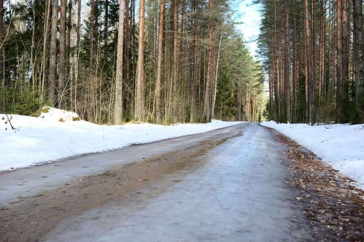
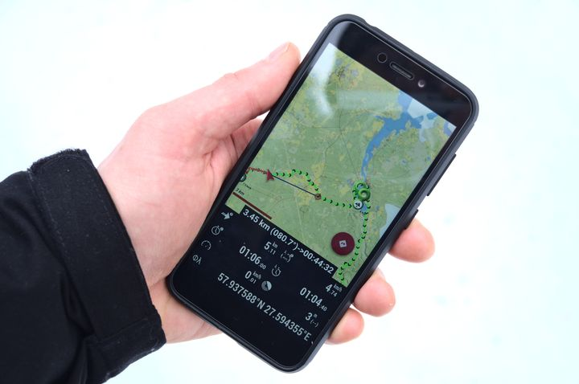
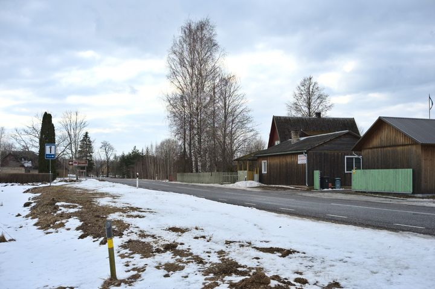
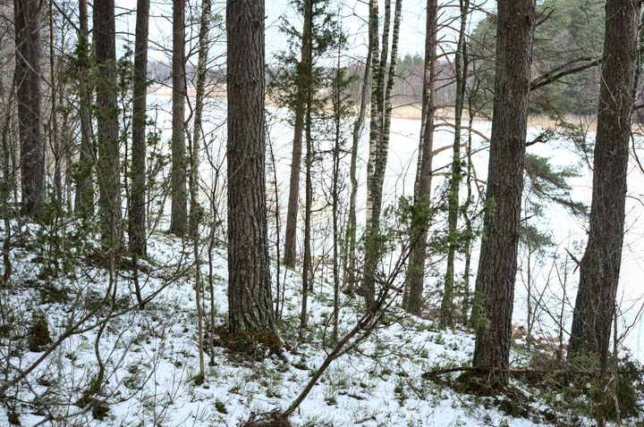
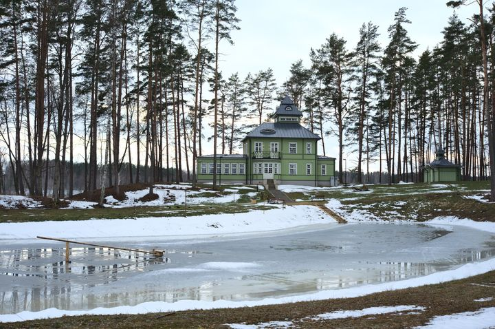
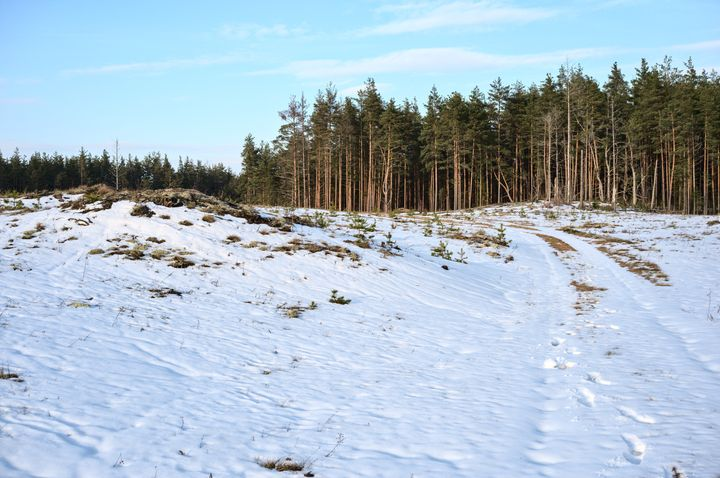
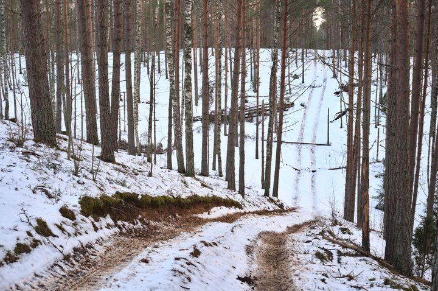
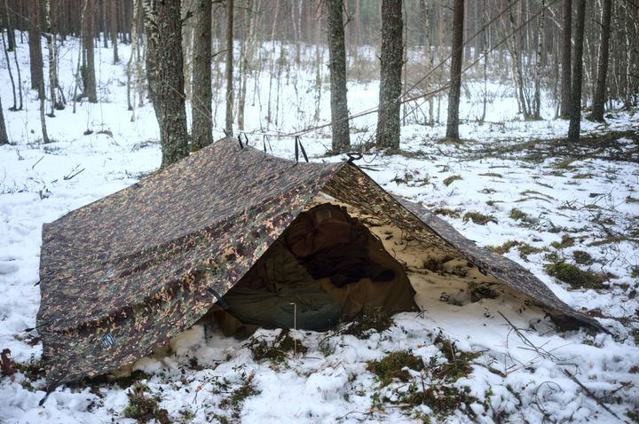
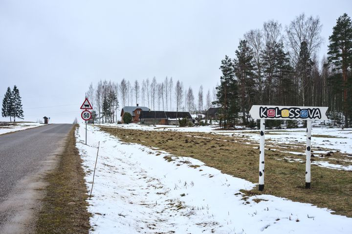

Matkateele oli jäänud veel ainult üks lõik, mida sai mugavalt alustada ja lõpetada rongipeatusest. Alguspunktiks olevasse Orava peatusesse jõudis rong umbes kell 11 ja teises otsas alustas tagasisõitu veidi pärast kella 15, sõltumata nädalapäevast. Seega polnudki väga palju rohkem valikuid kui jõuda selle 43 km pikkuse lõigu teise otsa alustamise päevale järgneval päeval. Teine võimalus olnuks jätta ööbimine vahele ja läbida osa rajast öösel, aga seda kaaluksin pigem mõnel teisel aastaajal.



Hommikul on minek kerge, sest sel korral olen suutnud pakkida seljakoti nii, et see kaalub koos liitri veega vaid 12 kg. Ilm on varakevadine. Paar nädalat tagasi alanud kevadilmad asendusid vahepeal talvega, aga nüüd on jälle kevad. Nii on maa läbimärg ja õhus mõned plusskraadid. Ei osanud kaugel kodus Kagu-Eesti teeolusid täpselt ette kujutada, aga arvasin, et kivised pinnasteed ikka libedad olla ei saa. Juba rongipeatusest väljudes on selge, et saavad küll. Esimesed sajad meetrid mööduvad kiilasjääl üsna aeglaselt. Siis on korraks kuivaks sõidetud asfalt, seejärel lörtsine kruusatee, jälle jää, siis jääkoorikuga lumi, kitsad rööpad hangedes, lihtsalt lumehang... ühesõnaga tervel rajal on teekate väga mitmekesine. Ühtäkki pean metsateel teelt kõrvale astuma, sest suure hooga kihutavad pori lennutades mööda neli maasturit. Siinkandis pole vist tõesti mitte midagi tarka teha, kui metsateel kihutamist peetakse mõistlikuks meelelahutuseks. Teekatete nimekirja lisandub igatahes nüüd ka korralik porimülgas. 

Tee kulgebki esimesed kilomeetrid puude vahel, vahelduvad mets ja raiesmikud. Näen teel inimeste jälgi, kaks jalutajat on kõndinud kõrvuti minule vastassuunas. Kuigi jäljed püsivad kilomeetreid, ei tea ikkagi, kas on oldud samal teel. Näen veel omajagu jälgi saabastega rändajatest, aga kõige rohkem on siin kandis ikkagi kõiksuguste kujude ja suurusega loomade jälgi. Ühel hetkel taipan, et saabaste jäljed on kadunud ning pilk telefonile näitabki, et oleksin pidanud koos nende jälgedega ära keerama. 

Orienteerumisel on mul abiks telefonis OruxMapsi rakendus, millesse on laetud Maaameti kaart ja matkatee rada. See rakendus koos kõige täpsema Eesti kaardiga pakub palju rohkem võimalusi ja on mugavam kui mistahes GPS seade. Kõige ägedam on võimalus mõõta täpselt suvaliste matkatee lõikude pikkust, valides lihtsalt raja otspunktid.

Metsatee katkeb korraks põldudega. See on metsadega ümbritsetud lage Treski küla. Esmalt paistab vasakul vanamoodsed, aga väga viisakad rehielamu-tüüpi taluhooned, seejärel paremal aiaga ümbritsetud vist köögivilja- või marjapõld. Tee on mudane. Asfalttee ääres olevad majad moodustavad vist küla keskkoha. Siin on autoremont ja tsässon ehk päris tilluke kabel, mille ristid viitavad õigeusule. Tagasi nüüd juba uuele pinnasteele keerates jääb õige pea teele rohke vanarauast põllutehnikaga ümbritsetud talu. Esmalt ilmub sealt üks haukuv koer, siis teine ja kui olen juba möödunud siis ka kolmas ning järgnevad mulle vihaselt haukudes. Kõik nähtavasti lähisugulased. Keeran järsku ümber, kui nad ehmatusest  juba tagasi kodu poole jooksevad.

Jõudes õige pea tagasi puude vahele, läheb tee edasi kenas männimetsas. Vaid loetud kilomeetrite pärast olen Värska külje all olevas Õrsava järve ääres. Siin on otse järve ääres tavaline RMK lõkkekoht. Veidi eemal on ka metsamaja, kus paar inimest askeldavad. Seega kõnnin pikalt peatumata edasi mööda Värska poole voolavat jõge. Tee meenutab vägisi Saesaare järve äärseid radu, kus samamoodi kulgeb tee järve ääress järskudest küngastest üles-alla mändide vahel.

Värskas tunnen silla ääres ära koha, kus poolteist aastakümmet tagasi olin ööbimas klassieksursioonil. Just seal samas kohas on alustatud maja ehitamist ja sild paistab olevat ka uus, aga muud uut siin ei paista. See sama suur metallist kandiline paak roostetab ikka veel kalda ääres. Loodan siin poes käia, aga 300m kaugusel asuvale COOPile suunav silt veenab, et nii väga pole vist ikka vaja. Värskast välja jalutades jäävad teele viisakad kortermajad ja sõna otseses mõttes männipuude keskel olev koolihoone. Tee läheb veel päris pikalt, enne kui Värska majad lõppevad. Muude huvitavate hoonete seas on siin ka kena äsja renoveeritud Värska külastuskeskus.

Kell on juba mitu tundi pärast lõunat, kui leian tee ääres pingi, kus korraks istuda ja kõhtu täita. Igati sobiv koht, kuna üle tee asub juhuslikut Vana söökla nime kandev hoone, kahjuks suletud. Ei viitsi isegi soojendada midagi. Et homme pärastlõunal rongile jõuda, sean eesmärgiks täna 30 km läbida, ja nii pole peatumiseks väga aega ka. Muidu on kusagil võsas toidu soojendamine ja tarbimine minu jaoks matkamise lahutamatu osa. Aga praegu, kui kogu maa on kaetud sulalumega või läbi vettinud ja kogu loodus näib eluta, ei tunne ma looduses pikutamisest puudust ka.

Möödudes sellest hoonest, kus Värska vett pudelitesse villitakse, keerab matkatee jälle metsa vahele. Kohe alguses on suusamajad ja edasi jalutangi mööda suusaradu, kus kohati veel rajamasina ja suuskade jäljedki paistavad. Siit algab Mustoja maastikukaitseala, mis on üks suur künklik inimasustusest puutumata mets. Kuna siin ei ole kunagi palju inimesi elanud ja siinne maastik on väga mitmekesine, siis umbes sada aastat tagasi valiti see koht sõjaliste õppuste pidamiseks. Tee äär on täis ilmselt väga erinevatel kümnenditel rajatud laskepesi, kaitsekraave ja muid auke. Avastan, et maa-ameti kaardil on reljeef on nii täpne, et isegi paarimeetrised mürsulehtrid on kaardil selgesti eristuvad. Korraks on siin ka üks lagendik, kus tahvlitel olevad selgitused ja jutustused loovad päris elava pildi sellest, kuidas siin sajandi eest sõdimist harjutatati. 

Mändidest ümbritsetud pinnastee on kena, aga ilmselt oleks siin palju mõnusam mõnel soojemal aastaajal, kui ümberringi ka natuke rohelist on. Maastik on reljeefne, mis teeb koos raske sulalumega kõndimise mitte just jalutuskäiguks pargis. Kohati langeb tee justkui 45 kraadise nurga all, et siis kohe sama järsult jälle tõusta. Metsasihtide asemel on pigem juhuslikult kulgevad teed ja alati ei vasta rajamärgistus orienteerumiseks kasutatava kaardi rajajoonele. Ühes kohas kõnnin õigest käänukohast mööda ja otsustan paarsada meetrit läbi sääreni lume tagasi õigele teel sumbata. Sisse sõidetud roobastega pinasteel on ikka tunduvalt lihtsam kui hangedes.

Pärast kella 18 hakkab hämarduma ja otsin ööbimiskohta. Leiangi natuke kõrgema koha puude keskel, mille vahele kate pingule tõmmata. Mul oli mingisugune omapärane nööride pingutamise viis, mille olen nüüd täiesti ära unustanud. Vist pool tundi jändan sellega, läheb päris hämaraks ja otstustan nöörid lihtsalt enam-vähem pingule siduda. Toitu ei viitsi siin pimedas madala katte all jälle soojendada. Närin vorsti ja juustu. Kuna pärast Värskat veekogusid ei ole siin täheldaud, siis peamiselt olen janu kustutanud lumega. Kui võtta lumi alumisest puhtamast kihist ja see enne neelamist suus üles sulatada, siis töötab see tehnika päris hästi. Ka nüüd täidan veepudeli lumega ja pistan magamiskotti, et hommikul oleks vesi võtta. Uinumiseks sobiva kellaajani on jäänud nii kaua, et jõuan enne seda veel poolteist filmi vaadata. Nagu ikka, kujutan jälle pimedas metsas ette igasuguseid helisid, aga kuna see kõrvaline koht on siin inimasustusest kaugel, siis tunnen ennast turvaliselt. Kauguses kostab vaid rongide kolin.

Alles hommikul katte alt välja ronides saan aru, millise käki olin üles seadnud. Kuigi see on öösel veel vajunud, siis vahepeal sadanud kerge vihm ja lörts minu ega mu varustuseni siiski ei jõudnud. Ka niiskena magamiskotti pistetud riided on hommikuks kuivad. Kui ennast kokku pakin, sajab veel lörtsi, aga mis teha, peab rongi peale ruttama.

Matkatee jätkub nii nagu eile pooli jäi, mööda metsateed. Näen kogu matka jooksul  ainult ühte looma, kui siin kits üle tee jookseb ja siis võsas korraks seisatab. Korraks on ümbrus lagedam, kui tee läbib nähtavasti Kolossova küla. Siin paistab olevat mingi teema lehmadega, aga nüüd talvel ühtegi lehma siin näha ei ole. Taamal olevast bussipeatuset möödudes keerab tee jälle metsa vahele. Maastikukaitseala jääb selja taha, nii et edasi vahelduvad metsad ja raiesmikud. 

Jalutan kuni Lõunalaagri lõkkekohani, kus pingid ja laud pakuvad kuivema koha konservi soojendamiseks. Kusagil eemal laseb keegi kõlaritest valju vaibakloppimist. Kes või miks, ei tea ega mõista. Just siis kui laual istudes plekk-karbist lusikaga risottot suhu ajan, tuleb seltskond lastega uudistama siin kõrval asuvat auku, mida praegu jääkaanega järveks pidada võib. 

Pärast lõkkekohta jätkub tee kultuursemalt, kuna sagedaseks muutuvad raja ääres olevad viidad selle koha ajaloo kirjelduste ja mälestustega. Lood on huvitavad, aga paraku pole nendes kirjeldatud viimase maailmasõja eel rajatud hoonetest järel isegi mitte varemeid. No mõni ikka on, aga enamustest rajatistest paistab olevat järgi jäänud paremal juhul aimatav jälg reljeefis. Kõikide lugudega tutvumiseks on natuke kiire, eks tuleb siia kunagi tagasi tulla. Tee kulgeb edasi üsna otse lääne suunas ja läbi poriseks sõidetud raiesmiku, kus äkki isegi veel nädala eest laius kena männik.

Edasi ei jätku tee üldse mitte sõiduteega, vaid mööda kunagist raudteed, kust liipridki üles võetud. See on nüüd esimene koht sellel matkal, kus teel ei ole ühtegi jälge varasematest liiklejatest, ei jala- ega rattajälgi. Seega pean sumama raskes sääreni ulatuvas lumes ja isegi pingutades liigun kiirusega umbes 3 km/h. Jõudes kohani, kus rongipeatus jääb peaaegu et otse lõunasse, keerangi endiselt raudteelt ära sinna poole. Järsust nõlvast alla, tasakaaluharjutus langenud palgil oja ületamiseks, siis jälle teisel pool nõlvast üles. 

Pärast raiesmiku ületamist peaksingi olema kohe rongipeatuses. Kuigi kaardi järgi eraldavad mind Kodula raudtejaamast nüüd vaid mõned kümned meetrid, siis tegelikult mahub sinna vahele ka päris mitme meetri kõrgune vall, mille otsas nõutult seisan. Vaatan vasakule-paremale ja kusagil selle otsa ei paista. Et kellelegi silma jäädes väga piinlik ei oleks, lähen hoonetest natuke eemale ja ukerdan hoopis seal nõlva otsast kuidagi alla. Ei tea, kas asi on sajakonna meetri kaugusel asuvas riigipiiris või milleski muus, aga rongipeatust ümbritseb siin kõrge tara ja rongini pääseb ainult läbi raudteejaama, mis on lukus. Ilmselt seetõttu, et rong väljub alles natuke rohkem kui tunni aja pärast. Ühtegi pinki siin ei ole, isegi bussipeatustes mitte, nii et istun trepil ja vaatan filmi. Paarkümmend minutit enne rongi väljumist on aga juba nii mitu inimest raudteejaama ukse poole läinud, et teen seda sama. Pääsen küll raudteejaama, aga kui kangutan teisele poole pääsemiseks ust, siis selgub, et see on ikka veel lukus. Nii pean veel kümmekond minutit teiste reisijatega koridoris passima, vähemalt on kõigil maskid ees. Arusaamatu koht, aga eks siin peale kohalike vist ei käida ja eks nemad saavad juba aru. Pühapäeval lõunapiirilt Tartusse sõitev rong on üsna tühi.