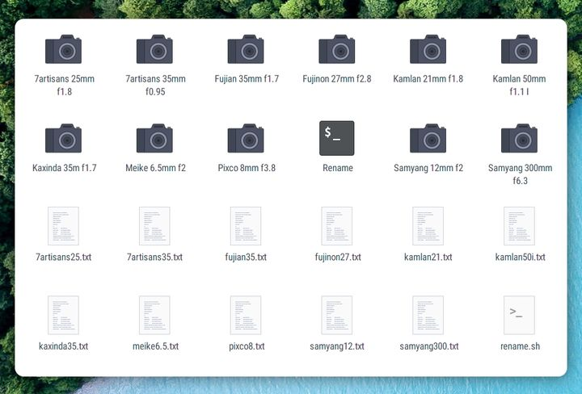
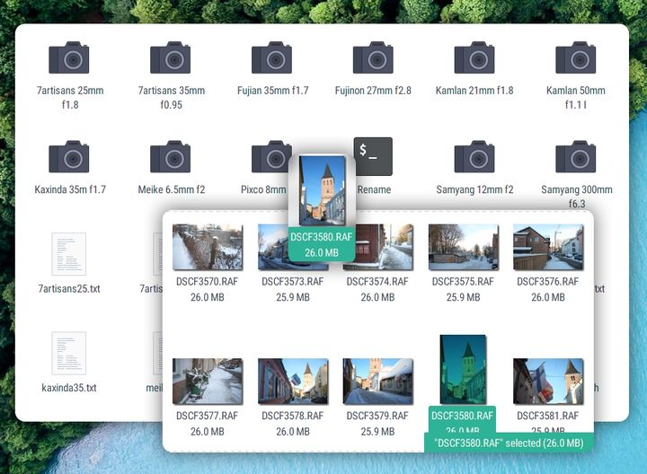

As someone obsessed with organizing and archiving things, I've been struggling with not having lens information in Exif of image files for photos taken with manual lenses. There is the ExifTool by Phil Harvey that can be ran on a command line but this is hardly convenient for adding lens info to a batch of photos. 

One way to overcome this inconvenience is to create a desktop file that applies an `exiftool` command to whatever file it is applied to. I've decided to keep lens details in separate text files so that for each lens there is a desktop file for applying and a text file that contains lens details. 



Then, adding the info in text files to one or more image files is as easy as just dragging and dropping an image file onto a desktop file. Note that this drag and drop is currently not supported by the Nautilus file explorer that is default for some Linux distributions. For instance, it works for Nemo file browser. And of course, the ExifTool app must also be installed.



A desktop file is simply a file with `.desktop` extension. The contents of a desktop file must begin with `[Desktop Entry]` and contain the command that is applied after `Exec=`.  The rest of the details in the example below should not be crucial. For ExifTool to apply lens information, the arguments to `exiftool` must either contain the details applied or a reference to a file containing these details. In the example below the latter approach is taken as `-@` refers to the text file containing lens details. The file that the command is applied to is represented by the `$u` argument.

``` {bash}
[Desktop Entry]
Name[en_US]=7artisans 35mm f0.95
Encoding=UTF-8
Exec=exiftool -@ /home/jrl/scrs/exiftool/7artisans35.txt %u
Icon=camera
Type=Application
```

The referenced file should include information on the lens name and parameters. What variables should be set, depends on purpose and software that handles this information. I've decided to include the details as in the example below.

```
-overwrite_original_in_place

-XMP:Lens=7artisans 35mm f0.95
-XMP:SerialNumber=21764
-EXIF:LensMake=7artisans
-EXIF:LensModel=7artisans 35mm f0.95
-EXIF:LensInfo=35 35 0.95 0.95
-EXIF:LensSerialNumber=21764
-EXIF:FocalLength=35
-EXIF:FocalLengthIn35mmFormat=53
-EXIF:MaxApertureValue=0.95
-EXIF:FNumber=0
-EXIF:Artist=Jyri Lillemets
-EXIF:Copyright=Jyri Lillemets
```

It's not an elegant solution but still convenient enough. ExifTool can be used in a similar way also in Windows (since I haven't used Windows in years, I've forgotten the details).

