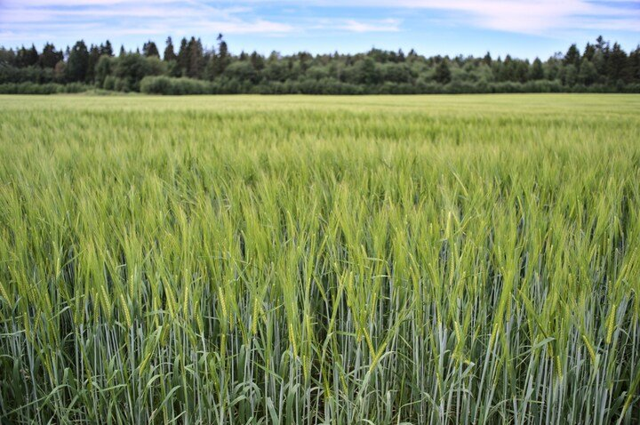
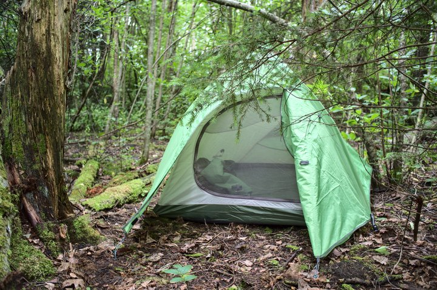

Seniseid matkateel läbitud lõike eraldas umbes 100 km pikkune teejupp Jõgeva ja Kavastu vahel. Selline paras teekond lühikeseks matkaks. Kui enamasti kavatsen selliseid käimisi mitu päeva ette, siis sel korral tuli ühel õhtul mõte, et jalutaks selle teejupi ära, ja järgmisel hommikul olin juba teel. 



Hommikul on ilm jalutamiseks paras, kuigi võiks jahedam olla. Sooja on paarkümmend kraadi ja taevas pilves. Kuna matkatee kulgeb Siimusti tagant, pean õigele teele  jõudmiseks Jõgeva raudteejaamast umbes tund aega jalutama. Ostan poest hommikusöögiks õuna. Kui olen just linnast välja põllu vahele jõudnud, hüppab teele metskits ja kaob siis vilja vahele. Rohkem ma teda kahjuks ei näe ja pildile ei saa.

Mul on meeles, et see teekond on umbes 100 km ja selle läbimiseks kulub rahulikult jalutades kolm päeva. Otsustan nüüd selle lõigu pikkuse kaardilt täpsemalt ära mõõta. Selgub, et Kavastusse on hoopis 125 km. Ehk umbes 33 km asemel tuleks nüüd päevas üle 40 km kõndida. Eks näis. Nelja päeva peale seda teekonda venitada ei tahaks.

Teen korraks kõrvalepõike teele jääval Siimusti kalmistul. Väga vanu ja huvitavaid hauaplatse silma ei hakka. Kalmistu värav on ümbritsetud lintidega ja on lootust, et see saab siis lähiajal värskema ilme.

Juba teekonna alguses saan aimu siinsest maastikust. Peamiselt põllud ja muidu lagendikud, aga kohati on ikkagi kenasid vaateid ka.

Väga suuri nõukaaegseid laudakolosse siinsetel põllumajanduslikel maastikel silma ei hakka. Vanad hooned (eelkõige varemed) on enamasti maakividest. Eks kuhugi on tulnud ju panna need kivid, mis põldu harides kunagi ette jäänud on. Enne Pedja jõge on üks eriti suur maakividest hoone. Üks kahte korrust läbiv tuba ja selle kõrval olev oja lubavad oletada, et tegemist on endise vesiveskiga. Oja on selge ja täiendan seal veevarusid. Külm vesi ojast on paremgi kui kaasas olev pudelivesi.

Teisel pool Pedja jõele ehitatud paisu on kaugele ulatuvad kalatiigid, millest matkatee möödub vaid riivates. Paisu ääres on hea puhkekoht. Kalatalu Härjanurmes. Koht on kena ja rahulik ning unustan end jalutama mööda tiigi äärt, enne kui taipan tagasi matkateele ronida.

Edasi teeb tee sisse U-kujulise jõnksu metsamaal, mis lisab teekonnale umbes tunni võrreldes lihtsalt otse läbi metsa jalutamisega. Metsa asemel on siin küll eelkõige raiesmikud. Peamiseks teekatte tüübiks on siinkandis erinevas suuruses kivid, mis on ilmselt kõige halvem teekate, millel jalutada. Juba päris varakult muutuvad tallad valusaks.

Selle ringi lõpus peaks olema väike tiik. Kohale jõudes selgub, et nii ongi: tuletõrje veevõtukoht. Ikkagi väga mõnus koht olemiseks, millele viitavad ka mitteametlik lõkkease ja alkoholipudelid selle ümber. Vee äärde astudes ehmatan kogemata seal aega veetvat pardipere. Pardiema teeb lennates kiirelt minekut, jättes pojad prääksudes talle järele siblima. Neil võttab vist ikka mitu minutit enne kui kobaras siputades teisele kaldale pilliroo vahele emale järgi jõuavad. On päris palav ja suplus mõjub värskendavalt.

Enne maantee ületamist on tee ääres eravalduse silt. Tee kulgub otsekui läbi kellegi õue ja ebaviisakas oleks läbi jalutada kui selline silt ette on pandud. Otsustan minna ümber õue. Paistab, et mõni eelmine matkateeline on sama otsuse teinud, kuna sildi juurest on keegi veel hiljuti veel võssa keeratud. Võsa on tihe, kärbseid täis ja künklik. Minutilise jalutuskägi asemel ronin nüüd veerand tundi läbi võsa, aga varsti olen tagasi teel.

Selmet otse üle raudtee minna, teeb matkatee raudteed mööda pika ringi. Kiusatus on lihtsalt üle minna, aga otsustan siiski teele jääda. Ületuskohta jõudes selgub jõnksu põhjus: kena vana truup, mille kaudu saab raudtee alt läbi jalutada. 

Ainus teele jääv vaatamisväärsus on Kassinurme linnamägi. Mingi seltskond juba asjatab seal palkmaja ümber ja mul polegi eriti viitsimist siin ringi vaadata. Võib-olla mõnel teisel korral. Mulle pakuvad huvi hoopis tee ääres olevad kätepesu jaks mõeldud kraanid, sest isegi kerge palavaga jalutades ei taha janu kuidagi järgi anda. Parku selgub, et kraanist vee saamiseks tuleks esmalt täita kraanide kohal olev paak.

Sellist kärbseuputust nagu siin teel ma küll ei mäleta, see on vist mingi selle suve eripära. Ükskõik, kus seisma jään, ümbritseb mind hetkega sumisev kärbseparv. See on siiski veidi leebem kui sääsed või parmud, kes tahavad tüki kaasa võtta. 

Ilm on maastiku jäädvustamiseks suurepärane. Pilvkate hajutab valgust ja ei pea valima, kas fotodel põleb ära taevas või jääb kõik muu tumedaks.

Õige pea pärast raudtee ületamist selle alt astun metsast välja ja leian end künka tipus. Kaugele avanev vaade annab märku, et olen jõudnud Vooremaale. Maastik on justkui mitmekihiline. Põld, mets, vahest järv, põld, mets ja alles siis taevas. Paraku on mul kaasas ainult lainurkobjektiiv, millega see maastiku eripära kuigi hästi pildile ei jää. 

Igatahes on tee siin künklik ja kuigi see kulgeb valdavalt voorede harjadel, tuleb pisikese Pikkjärve asula juures korraks põige madalamale teha. Seal asuv kaasaegse välimusega torn paistab kaugelt silma, aga lähedal paistab, et tegemist on siiski üles vuntsitud viljakuvati või mingi muu otstarbega vana hoonega. 

On pilves, aga õhk tundub niiske ja palav. Eriti seljakotti vedades. Vesi ei ole küll otsakorral, aga üritan seda säästa ja nii olen pidevas janus. Mõtlen astudes ainult veest. Mulliga vesi ja mullita vesi. Sidrunimaitseline vesi. Paar lonksu vett ei paista kuidagi janu kustutavat. 

Tee on täis pisikesi konnasid ja üritan ettevaatlikult astuda. Keegi harjutab teeäärses majas trummisoolot. Pikkjärvest möödudes ületan sealt algava Nava oja ja kasutan võimalust veepudelite täitmiseks. Murran läbi võsa vee äärde. Oja on madal ja veidi sogane. Sumiseva kärbseparve keskel ei ole aeganõudev pudelite läbi veefiltri täis soristaine kuigi meeldiv. Vesi on vastiku maitsega, aga ikkagi vesi.

Otsin kaardilt varjatumat ööbimiskohta, mis ei ole siin põldude vahel sugugi lihtne. Leian siiski tee äärde jääva väikese metsatuka, kuhu jõuangi veidi enne kella 21 ja pärast 41 km pikkust päevateekonda. Metsaalune on paras võsa ja pean tükk aega otsima enne kui leian telgi jaoks piisavalt suure risust puhta koha. Sääsed ei tee telgi püstitamist lihtsaks, aga õige pea saan end võrgu taha sulgeda ja jätkata õhtut filmiga. 

Teisel hommikul asun teele enne kella 9. Taevas on õnneks jälle pilves. Rada tundub selge ja nii astun mööda maanteed. Olen kõndinud üle kilomeetri, kui hakkab tunduma, et tee, mis peaks Raigastvere järve lõpuni olema sirge, on kuidagi käänuline. Kaarti vaadates avastan, et keerasin juba vähem kui paarisajandal meetril valesti ja kõndisin kilomeetri vales suunas. On ka võimalus minna lihtsalt teiselt poolt järve, aga otsustan siiski tagasi õige rajani jalutada. Sinna jõudes saan aru, mis segaduse põhjustas. Õige tee suundub justkui ühe talu õuele ja talu juures olevad eravaldusele viitavad sildid võivad jätta mulje, et seda teed ei tohiks kasutada. Samuti on matkatee silt oma kohalt maha võetud ja postkasti alla muru sisse peidetud. Huvitav, miks ja mida need inimesed siin kardavad. 

Edasi jäävad teele juba tuttavad kohad. Möödun Raigastvere vaatetornist, siis Elistvere loomapargist ja seejärel Vudilast. Veidi pärast Vudilat kuulen võsas mingit kohinat ja tiikide poole pöörates näen betoonist paisu kiiresti voolava selge veega. Täidan veepudelid. Kaamera teeb siin viimase klõpsu. Veel üleeile töötav aku ei võtnud eile üldse enam pilti ette ja varuakuga sain teha mitmesaja pildi asemel vähem kui sada. Nii et edasi ilmestab seda käiku kahjuks ainult jutt.

Maarja-Magdaleenas jääb teele selle lõigu ainuke pood. Kuna vesi on mul parajasti olemas ja palavaga isu ka eriti ei ole, siis jätan poeskäigu vahele. Sööngi ainult õhtuti.

Varsti jõuan Saarjärve äärde. Olin siin viimati veebruaris, kui õhutemperatuur oli umbes 40 kraadi madalam kui praegu, nii et nüüd on see koht natuke teistsugune. Lõkkekohtades pole kedagi ja kastan ennast vette. Ärkan jälle ellu. Järgmine ujumisvõimalus Kaiu järvede ääres on juba 8 km pärast. Sinna jõudmiseks pean umbes 700 m jalutama tiheda liiklusega maantee ääres. Üks suur veok möödub sellise hooga, et tõmbab pähe surutud nokatsi kaasa. Saan selle siiski kätte. 

Niipea, kui tee pöörab suuremalt maanteelt ära Kaiu järvede poole, algavad silla renoveerimisest ja läbipääsu puudumisest teatavad sildid. Vaatan kiirelt RMK matkatee kodulehte, aga seal ei ole selle kohta mingeid hoiatusi. Jätkan teed, lootes et kuidagi ikka üle Kääpa jõe saab. Üks mööduv auto pöörab tagasi. Tekib mõte, et see matk vist lõpebki siin, mis on isegi natuke lohutav. Ega ma seda killustikku, palavust, higistamist ja pidevat janu väga ei naudi ning mul polekski väga midagi selle vastu, kui kunagi jahedama ilmaga jätkata saaksin. Sillani jõudes selgub, et kuigi õige sild on puudu, siis on seal samas kõrval ajutine kitsas puidust sild. Nii et teekond ikkagi jätkub.

Kaiu järvede poole keerates asendub asfalt mõnusa künkliku metsateega. Valin peatumiseks lõkkekoha, kus tee ei ole veest kaugel. Kuna igasugune värskustunne eelmisest suplusest kadus juba kilomeetriga, siis kastan ennast jälle vette. Ei tahakski veest välja tulla. Kükitan parajasti kaelani vees, kui kõigest paari meetri kaugusel ujub minust mööda part, kuus tibu sabas. Veest välja tulles on jälle inimese tunne. Jalgu kuivatades leian varvaste vahelt pisikese kaani, keda pean tükk aega sikutama, enne kui lahti laseb. Nii juhtub kui mitu minutit muda sees kükitades parte vahtida.

Veel enne kui olen jõudnud järgmise lõkkekohani jalutada, on teel jälle eravaldusest teatav silt Kaiu Puhkemajade ees. Nojah, eks ronin siis jälle ümber tee majade tagant. Pärast seda kulgeb tee metsamaal. Siin on nüüd metsa isegi rohkem kui raiesmikku. Ühe kurvi peal loodan jälle leida eest hubase tuletõrje veevõtukoha, aga selle asemel on kinni kasvanud tiik, kuhu ma ei ulatu isegi vett võtma. 

Tee ääres on mõned majad, aga pärast Vea küla kaovad need täiesti. Kaardil järgi peaks pärast seda küla olema oja, aga pean pettuma, kui leian eest ainult kõdunevaid lehti täis kraavi. 

Huvitavaks läheb siis, kui jõuan Kärgandi mägede vahele. Niipea kui puude vahele jõuan, ümbritseb mind vihane sääseparv, keda kuidagi maha raputada ei õnnestu. Siin ümberringi eriti asustust ei ole, nii et olen nende jaoks ilmselt ainus võimalus süüa saada. Jooksen, aga sellest ei ole mingit abi. Seisma jääda ja pikad käised selga ajada ei tundu ka ei tundu mõistlik. Lisan kiirust ja järgmised kilomeetrid tegelen kätele ja kuklale imenud sääskede laiaks löömisega. Alles suuremale, asfaltkattega teele jõudes saan hoo maha võtta.

Kuna vett enam eriti järel ei ole, siis kavatsen päeva lõpetada ühe tiigi ääres. Sinna jõudes näen, et tegemist on auguga, mille põhjas on ainult madal loik, umbes nagu pisike Kaali kraater. Kuigi põhi on must, siis vesi on selge. Alles siis, kui olen umbes poolteist liitrit joonud, hakkab janu järgi andma. Olen jälle parajas võpsikus, aga leian siiski telgi jaoks koha. Öösel on palav, nii et higistan jälle magamiskotis. Nii pikka päevateed polegi ma varem matkanud - kokku 48 km. 

Hommikul ootab mind ees veel 38 km teekond Kavastusse. Hakkan liikuma jällegi enne kella 9. Ilmateade lubab pilvitut taevast ja kuni 30 soojakraadi ehk tõotab tulla kohutav ilm jalutamiseks. Pakin ennast kokku, aga eriti ei taha minna. Jalatallad on katki ja kukal päikese käes põlenud. Kui esimesel päeval ei teinudki peaaegu peatusi, siis nüüd võtan ette rutiini teha iga 5 km järel varjulisemas kohas peatus ja sokivahetus.

Kuigi teekond algab metsas, siis on päike kõrgel ja puud varju ei paku. Jõuan Alajõe külla. Tee äärde jääb suur tiikidega aedik, milles lisaks hanedele siblivad julgelt ringi koprad. Majad näevad siin kandis üsna värsked välja. Üleüldse elatakse tervel sellel lõigul viisakates majades. Muule Eestile iseloomulikke lagunevaid hurtsikuid on vähe ja sellised paistavad olevat siin kõik maha jäetud. 

Aga tee on siin kandis isegi kivisem kui Vooremaal ja pean igal sammul vaatama, kuhu astun. Olen ilmselt suuremal osal tervest sellest matkatee lõigust pidanud enda jalgeesist jõllitama. Hiljuti soetatud jäiga tallaga saapad tunduvad nüüd eriti hea ostuna, sest muud jalanõud sellistele matkateedele ei sobigi. Nii nagu Voormaal on ka siin minu jaoks arusaamatult jalgrattarajad. Peab ikka väga vihane olema enda ja oma jalgratta peale, et neid siia kiviklibule lõhkuma tulla.

Vist seetõttu, et olen sellel teel harjunud maha vaatama, märkan et teeääred on täis autodest pillutud pakendeid. Peamiselt suitsupakid. Ühes kohas vedeleb neid paarikümne meetri kohta maas mitu tükki. 

Sellise palavaga jalutades on tunne nagu viibiks palavas saunas, mille uks on mitmetunnise jalutuskäigu kaugusel. Kohati tundub õhk ümber nii kuum, et justkui keegi viskaks kusagil järjest leili. Lisaks välmisele palavusele kütan ennast ka seestpoolt raske seljakotiga kõndides. Mõtlen jälle ainult külmale veele. 

Enne kui jõuan Põrgu külla märkan kurvi tagant teel mingeid tegelasi. Kaks peesitavad päikese käes ja kaks müravad. Olen üsna kindel, et tegemist on mägrakutsikatega, sellised mustad ja valged triibud külgedel. Kahjuks ei oska ma ettevaatlik olla ja peletan nad juttu teha üritades põõsasse. 

Veel enne küla lõppu märkan viimases hoovis kahte koera. Hauguvad vihaselt, aga kummaliselt püsivad kindla perimeetri piirides. Paistab, et nutikett töötab. Veel enne kui neist mööduda jõuan, on teel uss. Keegi on vaesekesel üle pea sõitnud. Kiire pildiotsing näitab, et tegemist on rästikuga. 

Jõudes metsast välja, tuleb Kavastusse jõudmiseks läbida veel umbes 10 km üsna tiheda liiklusega asfaltteed põldude vahel. Siin puudub teekattemärgistus ja 100 km/h kiirusega mööduvad autod just turvatunnet ei tekita. Enne kui suurele teele keeran, on tee ääres hernepõld. Alguses hoian ennast tagasi, aga siis haaran peotäie herneid ja pistan need koos kaunadega sisse. Palavaga on need parimad herned, mida kunagi söönud olen.

Enne kella 19 olen Kavastus. Sellise palavaga matkamine ei ole ikka minu jaoks. Lõputu higistamine, joogijanu ja valusaks haududnud jalatallad muudavad iga teekonna ebameeldivaks. Eriti niivõrd igaval rajalõigul. Olen juba mitusada kilomeetrit sellel matkateel kõndinud ja tedsin, et tegemist ei ole mingi jalutuskäiguga metsas, vaid tuima kruusatee tallamisega. Ei pidanud pettuma. Sellele matkatee lõigule on mõtet tulla ainult sportima, mitte niisama aega veetma.
